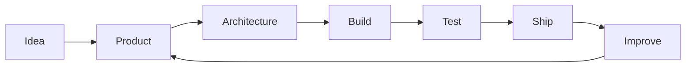

<div align="center">

# João Bahia

**Software Developer · Co-Founder @ Orbis Group**

`TypeScript` · `React` · `Cloudflare` · `Node.js`

<br>

Building software focused on **products, automation and real business operations**.

Based in **Portugal 🇵🇹**

<br>

[](https://linkedin.com/in/joão-bahia/)
[](https://github.com/obahia)

</div>

---

## ~/about

```typescript
interface Developer {
  name: string;
  role: string;
  company: string;
  location: string;
  interests: string[];
}

const me: Developer = {
  name: "João Bahia",
  role: "Software Developer",
  company: "Co-Founder @ Orbis Group",
  location: "Portugal 🇵🇹",

  interests: [
    "Product Engineering",
    "Full-Stack Development",
    "SaaS",
    "Automation",
    "System Architecture"
  ]
};
```

---

## ~/stack

<div align="center">


</div>

<br>

<table>
<tr>
<td width="33%" valign="top">

### Frontend

```txt
TypeScript
React
Tailwind CSS
Vite
```

</td>
<td width="33%" valign="top">

### Backend

```txt
Node.js
REST APIs
PostgreSQL
PHP
```

</td>
<td width="33%" valign="top">

### Infrastructure

```txt
Cloudflare
Docker
GitHub Actions
Git
```

</td>
</tr>
</table>

---

## ~/how-i-build



---

## ~/github

<div align="center">


</div>

---

<div align="center">

### `while (alive) { build(); learn(); improve(); }`

<sub>João Bahia · Software Developer · Orbis Group</sub>

</div>
