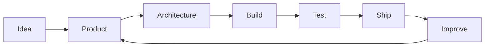

<div align="center">

# João Bahia

**Software Developer · Co-Founder @ Orbis Group**

`TypeScript` · `React` · `Cloudflare` · `Node.js`

<br>

Building software focused on **products, automation and real business operations**.

Based in **Portugal 🇵🇹**

<br>

[](https://linkedin.com/in/joão-bahia/)
[](https://github.com/obahia)

</div>

---

## ~/about

```typescript
interface Developer {
  name: string;
  role: string;
  company: string;
  location: string;
  interests: string[];
}

const me: Developer = {
  name: "João Bahia",
  role: "Software Developer",
  company: "Co-Founder @ Orbis Group",
  location: "Portugal 🇵🇹",

  interests: [
    "Product Engineering",
    "Full-Stack Development",
    "SaaS",
    "Automation",
    "System Architecture"
  ]
};
```

---

## ~/currently-building

### Orbis Group

> Software should simplify operations — not create more of them.

I'm currently building **Orbis**, a technology company focused on creating software for real operational problems.

My work involves:

```txt
Product Architecture
├── Frontend Engineering
├── Backend Systems
├── APIs & Integrations
├── Automation
├── Cloud Infrastructure
└── Product Development
```

---

## ~/stack

<div align="center">


</div>

<br>

<table>
<tr>
<td width="33%" valign="top">

### Frontend

```txt
TypeScript
React
Tailwind CSS
Vite
```

</td>
<td width="33%" valign="top">

### Backend

```txt
Node.js
REST APIs
PostgreSQL
PHP
```

</td>
<td width="33%" valign="top">

### Infrastructure

```txt
Cloudflare
Docker
GitHub Actions
Git
```

</td>
</tr>
</table>

---

## ~/how-i-build



I like working close to the **product**, understanding the actual problem before writing code.

My goal isn't just to make something work.

It's to build software that is:

`useful` → `maintainable` → `scalable` → `shipped`

---

## ~/work

<table>
<tr>
<td>

### 🪐 Orbis Group

**Co-Founder**

Building products and technology focused on business operations, automation and software architecture.

</td>
</tr>

<tr>
<td>

### 💻 Realize Consultoria

**Software Developer**

Working on business platforms, internal systems and production applications across frontend and backend.

</td>
</tr>
</table>

---

## ~/github

<div align="center">


</div>

---

## ~/activity

<div align="center">


</div>

---

<div align="center">

### `while (alive) { build(); learn(); improve(); }`

<sub>João Bahia · Software Developer · Orbis Group</sub>

</div>
